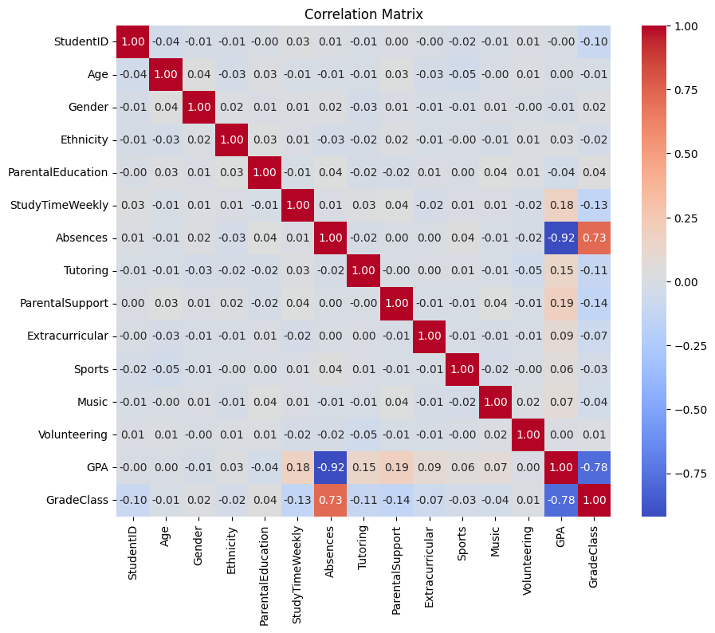

# 🎓 Student Performance Prediction System

Bayesian Network-Based Intelligence for Academic Performance Insight

---

## 📌 Project Overview

This project implements a **Bayesian Network model** to predict student academic performance—specifically GPA and grade classification—by analyzing various factors such as study habits, attendance, and support systems. The system delivers actionable insights and personalized recommendations to improve academic outcomes.


_Figure 1: Correlation Matrix between key academic and behavioral factors_

---

## 🔍 About the Program

### 🧠 Model Architecture

The Bayesian Network models probabilistic dependencies among:

- **Independent Factors**: Gender, Ethnicity, Parental Education, Sports, Music, Volunteering
- **Intermediary Nodes**: Tutoring, Parental Support, Extracurricular
- **Direct Academic Influences**: Study Time, Absences
- **Target Outcomes**: GPA → GradeClass (A, B, C, D, F)

This structure was defined based on **correlation analysis** (see Figure 1), domain knowledge, and data interpretability.

### ✅ Key Features

- 🔄 **Bayesian Network** for interpretable probabilistic reasoning
- 📊 **Correlation-Driven Modeling** based on strong predictors (e.g., Absences ↔ GPA = -0.92)
- 🤖 **Prediction Engine** for GPA and letter-grade classification
- 📈 **Recommendation System** for personalized academic improvement
- 💡 **Intervention Impact** estimation on predicted GPA
- 🌐 **Web Interface** built with Flask
- 🔬 **Model Evaluation** using cross-validation and benchmarking

---

## 🏗️ System Structure

```plaintext
📁 student-performance-predict/
│
├── app.py                      # Flask Web Server
├── models/
│   ├── bayesian_model.pkl
│   ├── evaluation_metrics.pkl
│   └── gpa_quantiles.pkl
├── data/
│   └── Cleaned_Student_performance_data.csv
├── UI/                         # Web assets
├── requirements.txt
└── README.md
```

---

## 🚀 Getting Started

### 📦 Requirements

- Python 3.7+
- Flask
- pip

### 🧪 Installation

```bash
git clone <repository-url>
cd student-performance-predict
pip install -r requirements.txt
```

### 🖥️ Running the App

```bash
python app.py
```

Visit the web interface at: [http://127.0.0.1:5000](http://127.0.0.1:5000)

---

## 🧪 Usage Guide

### 🧾 Input Fields

- Study time per week
- Number of absences
- Gender, Ethnicity, Parental Education
- Tutoring / Parental Support / Extracurricular participation
- Involvement in Sports, Music, Volunteering

### 📈 Output

- **Predicted GPA** (0.0 - 4.0 scale)
- **GPA Category**: VeryLow to VeryHigh
- **GradeClass**: Letter grade (A to F)
- **Recommendations** with estimated GPA impact

---

## 📡 API Endpoints

### 1. `/predict`

**POST** request:

```json
{
  "StudyTimeWeekly": 18,
  "Absences": 1,
  "Gender": 1,
  "Ethnicity": 1,
  "ParentalEducation": 1,
  "Tutoring": 1,
  "ParentalSupport": 1,
  "Extracurricular": 1,
  "Sports": 0,
  "Music": 1,
  "Volunteering": 0
}
```

**Response:**

```json
{
  "gpa": 3.35,
  "gpa_bin": 3,
  "gpa_bin_label": "High",
  "gradeClass": 1,
  "gradeClass_label": "B"
}
```

### 2. `/recommend`

Provides improvement suggestions:

```json
{
  "recommendations": [
    {
      "factor": "Study Time",
      "issue": "Weekly study time below optimal level",
      "recommendation": "Increase study time to 15 hours per week",
      "impact": 0.45
    }
  ],
  "potential_gpa": 3.8
}
```

---

## 📊 Performance Metrics

| Metric                | Value  |
| --------------------- | ------ |
| MAE (GPA)             | 0.2668 |
| RMSE (GPA)            | 0.3323 |
| Accuracy (GradeClass) | 91.65% |
| Precision             | 91.79% |
| ROC AUC               | 0.9009 |
| Calibration Error     | 0.2890 |

---

## 📖 Model Insights

- **Study Time**: Most impactful variable (optimal ≈ 15 hours/week)
- **Absences**: Strong inverse correlation (ρ = -0.92)
- **Tutoring & Parental Support**: Moderate positive influence
- **Extracurricular Activities**: Slight positive impact

📌 **Note**: Bayesian Networks handle missing data via marginal inference, making the model robust in real-world scenarios.

---

## 📚 Dependencies

- `pandas`, `numpy` — Data preprocessing
- `scikit-learn` — Evaluation metrics
- `pgmpy`, `networkx` — Bayesian Network modeling
- `matplotlib`, `seaborn` — Data visualization
- `flask` — Web API
- `joblib` — Model persistence

---

## 📜 License

Distributed under the MIT License. See `LICENSE` for more details.

---

## 🙏 Acknowledgments

- **Dataset**: `Cleaned_Student_performance_data.csv`
- **Bayesian Network Principles**: Inspired by academic work in probabilistic graphical modeling
- **Visualization Support**: Correlation heatmaps and DAGs from project notebooks
